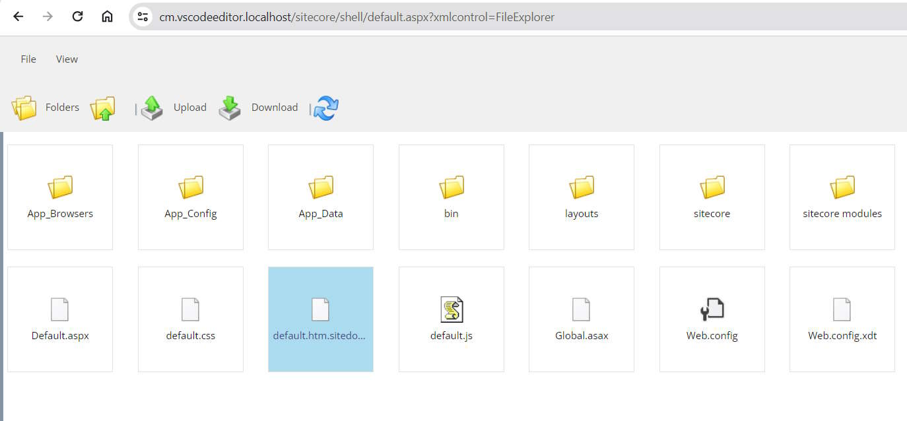
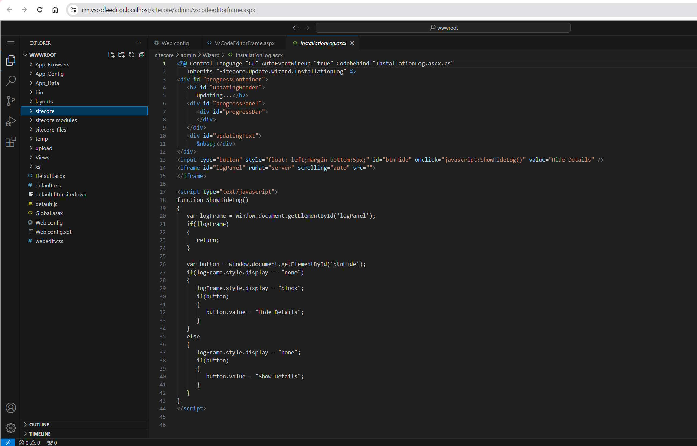

# Hackathon Submission Entry form

## Team name
Ererenderingdering

## Category
Best Module for XM/XP or XM Cloud

## Description

Remember Sitecore File Editor? 

The link to this module disappeared in Sitecore 8.1. And there was no attention to this part of Sitecore. It becomes uglier over the latest browser updates. We want to make it better. We want to make it great. And what editor could be better than Visual Studio Code? We want to use it as a code editor for Sitecore on servers as well.

The module allows to browse your code on your instanse using hosted Visual Studio Code.

Implementaion relies on [VS Code Server](https://github.com/coder/code-server). It requires dependeincies to be installed on the server.
It is the same Visual Studio Code that you love but running on the server. 

The initial intention was to use Sitecore as a proxy, but we didn't manage to configure it properly for web sockets. So we used a workaround to make it work. It's not secure and should not be used in the production.

Editing is not supported, only viewing due to Windows containers nature.

## Video link
⟹ Provide a video highlighing your Hackathon module submission and provide a link to the video. You can use any video hosting, file share or even upload the video to this repository. _Just remember to update the link below_

⟹ [Replace this Video link](#video-link)

## Pre-requisites and Dependencies

- Docker 4.22.0 (117440) or later

## Installation instructions

1. Clone the repository
2. Switch working directory to `./src`
3. Run `./init.ps1 -InitEnv -Topology xm1` by Administrator to initialize the environment
   1. Set path to Sitecore license file
   2. Set Sitecore admin password
4. Run `./up.ps1` to start the environment. Be patient, it downloads Docker images and install dependencies. It may take a while. You may think that it's stuck on `visualstudio2019-workload-vctools`, `visualstudio2019buildtools`, or `windows-sdk-10-version-1809-all` but it's not. It's just slow.

### Configuration

No additional configuration is required.

## Usage instructions

1. Open Sitecore Launchpad
2. Click on `Code` Application. It should open new page with Visual Studio Code under `https://cm.vscodeeditor.localhost/sitecore/admin/vscodeeditorframe.aspx` URL
3. Enjoy editing your code using Visual Studio Code. It has all the features you love in VS Code.

## Comments
Please don't use it in the production. We cut the cornres to make it work for submission. It is not secure.
We need to add secure proxy for web sockets in the similar way as we did for web requests. It will allow to use it in the production.
